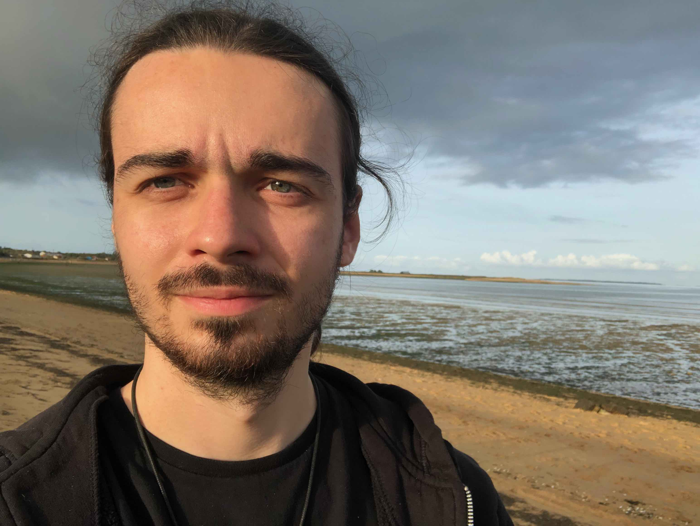

## About Me

I am a PhD graduate at [MAP5](http://w3.mi.parisdescartes.fr/map5/) Laboratory, in [Université Paris Cité](https://u-paris.fr/en/), under the supervision of [Fabienne Comte](http://helios.mi.parisdescartes.fr/~comte/) and [Céline Duval](https://sites.google.com/site/celinehduval/). I study the use of non-compactly supported bases in nonparametric estimation problems. 

From Ocotber 2019 to June 2021, I was also the coorganizer with [Anton François](http://helios.mi.parisdescartes.fr/~afrancoi/) of the [GTE](https://map5.mi.parisdescartes.fr/seminaires/thesards-docteurs/), the PhD students seminar of the MAP5 Laboratory. 

## Research Topics

- Nonparametric Deconvolution
- Nonparametric Regression
- Multivariate Orthogonal Bases
- Ruin probabilities

## Contact

[`florian.dussap@u-paris.fr`](mailto:florian.dussap@u-paris.fr)

Laboratoire MAP5  
UFR de Mathématiques et Informatique  
Université Paris Cité  
45 rue des Saints-Pères  
75006 Paris, France

Bureau 750
