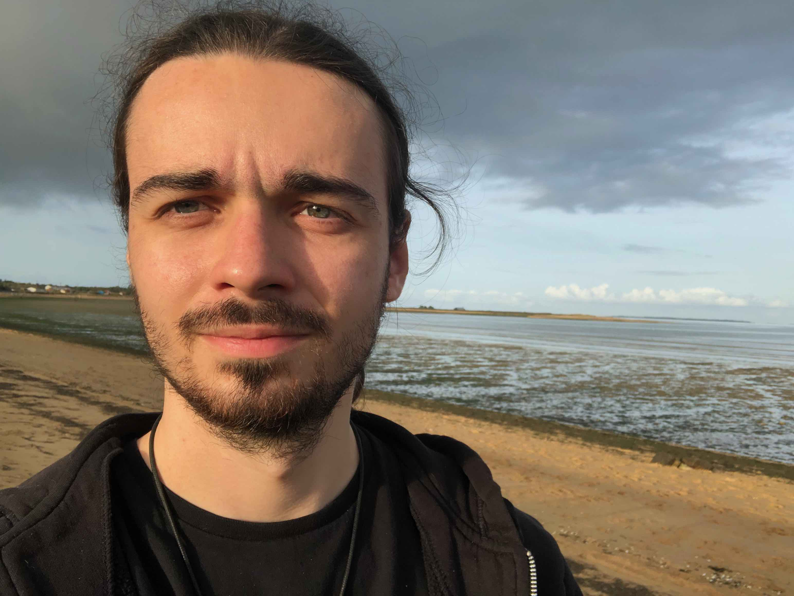

I am a math teacher at *Lycée Gaspard Monge* in Savigny-sur-Orge, France.

I am a former researcher in Statistics. My research topic was the use of non-compactly supported bases in nonparametric estimation problems.
